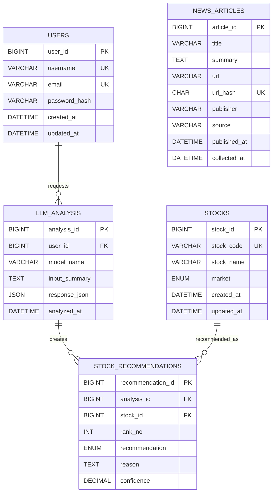

# ERD

```mermaid
erDiagram
    USERS ||--o{ LLM_ANALYSIS : requests
    LLM_ANALYSIS ||--o{ STOCK_RECOMMENDATIONS : creates
    STOCKS ||--o{ STOCK_RECOMMENDATIONS : recommended_as

    USERS {
        BIGINT user_id PK
        VARCHAR username UK
        VARCHAR email UK
        VARCHAR password_hash
        DATETIME created_at
        DATETIME updated_at
    }

    STOCKS {
        BIGINT stock_id PK
        VARCHAR stock_code UK
        VARCHAR stock_name
        ENUM market
        DATETIME created_at
        DATETIME updated_at
    }

    NEWS_ARTICLES {
        BIGINT article_id PK
        VARCHAR title
        TEXT summary
        VARCHAR url
        CHAR url_hash UK
        VARCHAR publisher
        VARCHAR source
        DATETIME published_at
        DATETIME collected_at
    }

    LLM_ANALYSIS {
        BIGINT analysis_id PK
        BIGINT user_id FK
        VARCHAR model_name
        TEXT input_summary
        JSON response_json
        DATETIME analyzed_at
    }

    STOCK_RECOMMENDATIONS {
        BIGINT recommendation_id PK
        BIGINT analysis_id FK
        BIGINT stock_id FK
        INT rank_no
        ENUM recommendation
        TEXT reason
        DECIMAL confidence
    }
```

`news_articles`는 전체 금융 뉴스를 저장하는 테이블이다.
특정 종목과 직접 연결하지 않고, LLM 분석 입력 데이터로 사용한다.
