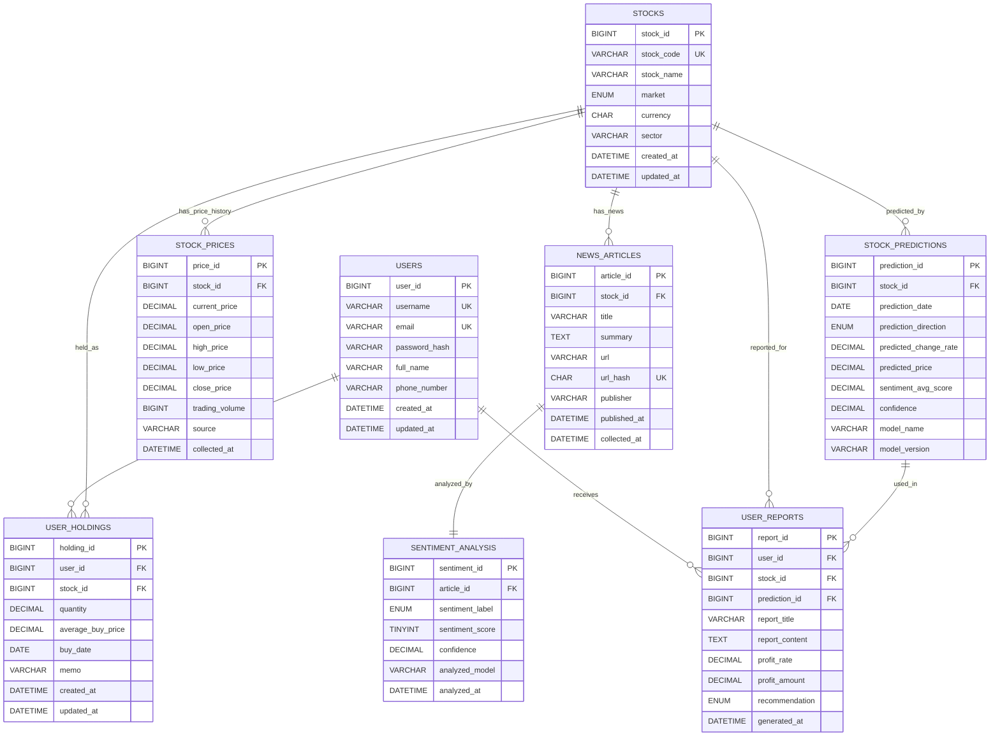

# 데이터베이스 ERD 시각화

아래 코드는 Mermaid를 지원하는 Markdown 환경에서 바로 ERD로 렌더링된다.
GitHub README, Notion, Mermaid Live Editor, 일부 PPT 도구에서 활용할 수 있다.

## 발표용 핵심 설명

- `users`는 사용자 계정 정보를 저장한다.
- `stocks`는 종목 기본 정보를 저장한다.
- `user_holdings`는 사용자와 종목을 연결하며 보유 수량, 평균 매수가, 매수일을 저장한다.
- `stock_prices`는 종목별 현재가와 시세 이력을 저장한다.
- `news_articles`는 종목 관련 뉴스 기사 정보를 저장한다.
- `sentiment_analysis`는 각 뉴스 기사에 대한 감성 분석 결과를 저장한다.
- `stock_predictions`는 뉴스 감성 평균 점수 등을 기반으로 계산한 주가 예측 결과를 저장한다.
- `user_reports`는 사용자 보유 정보, 수익률, 예측 결과를 종합한 최종 리포트를 저장한다.

## 발표 때 한 문장 요약

> 이 ERD는 사용자 보유 주식 정보를 중심으로 시세 데이터, 뉴스 데이터, 감성 분석 결과, 주가 예측 결과, 최종 투자 리포트가 단계적으로 연결되는 구조입니다.
